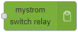

# node-red-contrib-mystrom-switch

MyStrom Switch nodes to control the switches with Node-RED.

## Description

This contrib module provides two simple nodes to get the current statue of a MyStrom Switch and to enable or disable the relay.

## Nodes

### mystrom switch status

Node to get the current state of a MyStrom Switch.

### mystrom switch relay

Node to turn the relay status of a MyStrom Switch on or off.

## Constraint

This module is not associated with the MyStrom AG.

This software is provided "as is", without any guarantees on the function and operation of the MyStrom Switch devices. You use it at your own risk. For more details, check the license terms.
